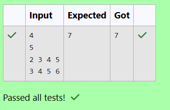

# EX 5A 0/1 Knapsack Problem - Branch&Bound 
## DATE: 05/11/2025
## AIM:
To Write a Java program to solve 0/1 Knapsack problem using Branch and Bound Approach.
You are heading a college entrepreneurship cell that can invest in up to N student‑startups.

For each startup i you know: cost[i]  — the amount (in ₹ lakh) required to join the showcase profit[i] — the estimated profit (in ₹ lakh) you’ll gain if it succeeds You have a total budget of B ₹ lakh. Pick a subset of startups so that the sum of costs ≤ B and the sum of profits is maximised.

Because N can be as large as 50, a plain exhaustive search (2^N) is too slow.

The recommended approach is Branch & Bound with a fractional‑knapsack upper bound (but any algorithm that meets the constraints is accepted). 

Input Format

N

B

cost[1] cost[2] … cost[N]

profit[1] profit[2] … profit[N]

1 ≤ N ≤ 50

1 ≤ B ≤ 1 000 000

1 ≤ cost[i], profit[i] ≤ 10 000 

Output Format

maxProfit

For example:


## Algorithm
1. Start the program.
2. Sort items in descending order of profit-to-cost ratio, then use DFS to explore including or excluding each item while tracking current cost and profit.
3. At every node, compute a fractional knapsack upper bound; prune the branch if this bound is ≤ current best profit.
4. Update the global best when a better profit is reached and continue DFS only on branches that are feasible and promising. 
5. End the program.

## Program:
```
/*
Program to implement Reverse a String
Developed by: HARINI R
Register Number: 212223100010
*/

import java.util.*;

public class StartupShowcaseOptimizer {

    // ---------- Global data ----------
    static int N, B;
    static int[] c, p;          // cost, profit after sorting by ratio
    static int best = 0;        // incumbent best profit

    // ---------- Fractional upper bound ----------
    static double bound(int idx, int cw, int cv) {
        //Type your code
        int rem=B-cw;
        int ub=cv;
        int i=idx;
        while(i<N && c[i]<=rem)
        {
            rem-=c[i];
            ub+=p[i];
            i++;
        }
        if(i<N && rem>0)
        {
            ub+=p[i]*((double)rem/c[i]);
        }
        return ub;
    }

    // ---------- DFS Branch & Bound ----------
    static void dfs(int idx, int cw, int cv) {
        //Type your code
        if(cw>B) return;
        if(cv>best) best=cv;
        if(idx>=N) return;
        double ub=bound(idx,cw,cv);
        if(ub<=best) return;
        if(cw+c[idx]<=B)
        {
            dfs(idx+1,cw+c[idx],cv+p[idx]);
        }
        dfs(idx+1,cw,cv);
    }

    public static void main(String[] args) {
        Scanner sc = new Scanner(System.in);
        N = sc.nextInt();
        B = sc.nextInt();
        int[] cost = new int[N];
        int[] prof = new int[N];
        for (int i = 0; i < N; i++) cost[i] = sc.nextInt();
        for (int i = 0; i < N; i++) prof[i] = sc.nextInt();
        sc.close();

        // Sort by profit/cost ratio descending → tighter bounds
        Integer[] idx = new Integer[N];
        Arrays.setAll(idx, i -> i);
        Arrays.sort(idx, Comparator.comparingDouble(i -> -(double) prof[i] / cost[i]));

        c = new int[N];
        p = new int[N];
        for (int i = 0; i < N; i++) {
            c[i] = cost[idx[i]];
            p[i] = prof[idx[i]];
        }

        dfs(0, 0, 0);
        System.out.println(best);
    }
}
```

## Output:



## Result:
The program successfully solved 0/1 Knapsack problem using branch & bound and output is verified. 
