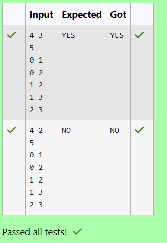

# EX 5C Graph coloring
## DATE: 07/11/2025
## AIM:
To write a Java program to for given constraints.
Problem Description:
In a hilly region, several radio towers are installed to provide communication services. However, due to signal interference, two adjacent towers (i.e., in communication range of each other) must not use the same frequency channel.

You are given N radio towers and their communication ranges represented as an undirected graph. Your task is to assign channels (colors) to these towers using at most M channels such that no two adjacent towers use the same channel.

Write a program to determine if such an assignment is possible or not.

Input Format:
First line contains two integers: N (number of towers), and M (number of available frequency channels).

Next line contains an integer E — number of edges representing the communication range.

Next E lines contain two integers u and v — representing that tower u and tower v are within range (0-based index).

Output Format:
Print "YES" if it's possible to assign frequencies to towers such that no two adjacent towers have the same frequency.

Otherwise, print "NO".


## Algorithm
1. Start the program.
2. Try assigning each tower a channel from 1 to m, checking that no adjacent tower already uses the same channel.
3. If a channel is safe, assign it and recursively color the next tower.
4. If all towers are colored successfully, return true; otherwise backtrack and try other assignments until success or exhaustion. 
5. End the program.  

## Program:
```
/*
Program to implement Reverse a String
Developed by: HARINI R
Register Number: 212223100010 
*/

import java.util.*;

public class RadioTowerChannelAssignment {

    public static boolean isColorable(List<List<Integer>> graph, int[] color, int node, int m, int n) {
        //Write your code
        if (node == n) return true;
        for (int c = 1; c <= m; c++)
        {
            boolean safe = true;
            for (int neigh : graph.get(node)) 
            {
                if (color[neigh] == c) 
                {
                    safe = false;
                    break;
                }
            }
            if (!safe) continue;
            color[node] = c;
            if (isColorable(graph, color, node + 1, m, n)) return true;
            color[node] = 0;
        }
        return false;
    }

    

    public static void main(String[] args) {
        Scanner sc = new Scanner(System.in);
        int n = sc.nextInt(); // number of towers
        int m = sc.nextInt(); // number of channels
        int e = sc.nextInt(); // number of connections

        List<List<Integer>> graph = new ArrayList<>();
        for (int i = 0; i < n; i++)
            graph.add(new ArrayList<>());

        for (int i = 0; i < e; i++) {
            int u = sc.nextInt();
            int v = sc.nextInt();
            graph.get(u).add(v);
            graph.get(v).add(u);
        }

        int[] color = new int[n];

        if (isColorable(graph, color, 0, m, n))
            System.out.println("YES");
        else
            System.out.println("NO");

        sc.close();
    }
}
```

## Output:



## Result:
The program successfully implemented and the expected output is verified.
