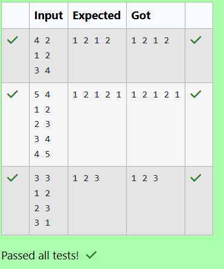

# EX 5D Flower Planting.
## DATE: 08/11/2025
## AIM:
To write a Java program to for given constraints.
You are given n gardens, labelled from 1 to n.

You also have a list called paths, where each element paths[i] = [xi, yi] represents a bidirectional road connectingthe  garden xi and garden yi.

You want to plant one flower in each garden, and there are exactly 4 types of flowers labelled as 1, 2, 3, and 4.

Your goal is to plant flowers such that:

No two connected gardens (i.e., connected via a path) have the same flower type.

Return any valid flower assignment as an array where:

answer[i] is the flower type planted in the (i+1) ᵗʰ garden

It is guaranteed that:

No garden is connected to more than 3 other gardens

A valid flower assignment always exists


## Algorithm
1. Start the program.
2. Build an adjacency list and for each garden, mark the flower types already used by its neighbors.
3. From flower types 1 to 4, pick the first type not used by any adjacent garden.
4. Assign that flower to the current garden and repeat for all gardens to produce a valid 4-color assignment. 
5. End the program. 

## Program:
```
/*
Program to implement Reverse a String
Developed by: HARINI R
Register Number: 212223100010 
*/

import java.util.*;

public class GardenFlowerPlanner {

    public static int[] assignFlowers(int n, int[][] paths) {
        @SuppressWarnings("unchecked")
        List<Integer>[] adj = new ArrayList[n];
        // Type Your Code Here.
        for (int i = 0; i < n; i++) adj[i] = new ArrayList<>();
        for (int[] p : paths) 
        {
            int a = p[0] - 1;
            int b = p[1] - 1;
            adj[a].add(b);
            adj[b].add(a);
        }
        int[] res = new int[n]; 
        for (int i = 0; i < n; i++)
        {
            boolean[] used = new boolean[5]; 
            for (int nb : adj[i]) 
            {
                int c = res[nb];
                if (c != 0) used[c] = true;
            }
            for (int color = 1; color <= 4; color++) 
            {
                if (!used[color]) 
                {
                    res[i] = color;
                    break;
                }
            }
        }
        return res;
    }

    public static void main(String[] args) {
        Scanner sc = new Scanner(System.in);

        int n = sc.nextInt(); 
        int m = sc.nextInt(); 

        int[][] paths = new int[m][2];
        for (int i = 0; i < m; i++) {
            paths[i][0] = sc.nextInt();
            paths[i][1] = sc.nextInt();
        }
        int[] result = assignFlowers(n, paths);

        for (int flower : result) {
            System.out.print(flower + " ");
        }
        System.out.println();
    }
}
```

## Output:



## Result:
The program successfully implemented and the expected output is verified.
